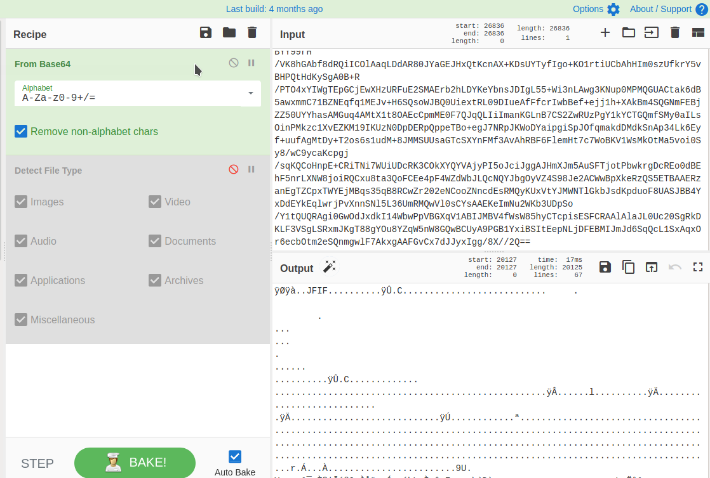
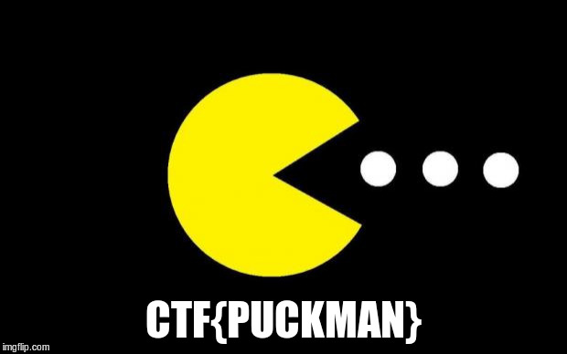

# Author: Panagiotis Fiskilis/Neuro

# Challenge name: BsidesSF CTF 2019: blink

Lore:

```
Get past the Jedi mind trick to find th flag you are looking for. 
```

Solution:

We get an APK file ```blink.apk```

```bash
mkdir blink_unziped
cp blink.apk blink_unziped
cd blink_unziped
unzip blink.apk
sudo apt install dej2jar
d2j-dex2jar -h
d2j-dex2jar classes.dex
```

We open the new jar file in ```JD-GUI```

Inside it we find a ```r2d2.clas``` that we reverse engineer and find a huge base64

We use ```CyberChef``` to decode it and get the Flag





**Flag:**

CTF{PUCKMAN}
