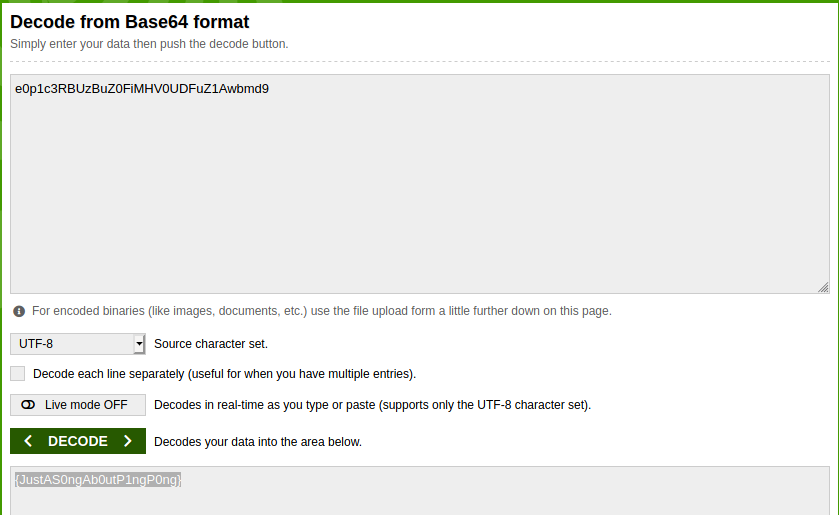

# Author:Panagiotis Fiskilis/Neuro

# challenge name:BsidesSF CTF 2019: Table-tennis

Lore:

```
The flag is in the Pcap, can you find it?
```

## Solution: ##

We start with some low hanging fruits:

```bash
strings out.pcapng
wiresahrk out.pcapng
```

We start by looking at the <code>Protocol Hierarchy</code>

We see a lot of <code>ICMP(Ping)</code> traffic so we start focussing on a ping exfiltration method.

We use the <code>ICMP</code> filter and start checking the data segment of the packets and see that there are some base64 characters inside it.

We copy them and get:

```
e0p1c3RBe0p1c3RBe0p1c3RBe0p1c3RBe0p1c3RBUzBuZ0FiUzBuZ0FiUzBuZ0FiUzBuZ0FiMHV0UDFuMHV0UDFuMHV0UDFuMHV0UDFuMHV0UDFuZ1Awbmd9Z1Awbmd9Z1Awbmd9Z1Awbmd9Z1Awbmd9
```

As a non clean form of the data that the attacker exfiltrated


After some cleaning and guessing we get:



## Flag: ##

CTF{JustAS0ngAb0utP1ngP0ng}
