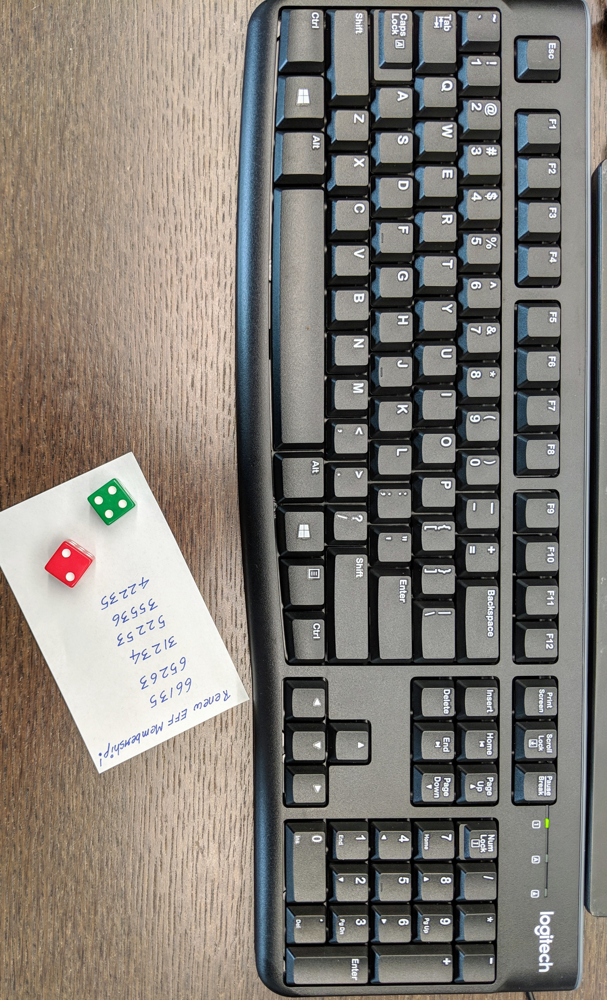

# Author:Panagiotis Fiskilis/Neuro

# Challenge name:BsidesSF CTF 2019: Goodlucks 1

Lore:

```
We've recovered an encrypted disk image from an insider threat. While he won't give up the passphrase, we think the post-it note is related.
```

Solution:

The Challenge gives us 2 files a .7z with the disk image and an actual jpg image

We view the image with:

```bash
eog goodluks1.jpg
```



And extract the 7z file

```bash
7z e goodluks1.7z
```

We guess that the note from the image contains the password for the disk image

Let's see some info about the .img file from the 7z

```bash
file goodluks1.img
testdisk goodluks1.img
```

With testdisk we create a partition backup image under the name: <code>image.dd</code>

```bash
file image.dd
```

And get:

```
image.dd: LUKS encrypted file, ver 1 [aes, xts-plain64, sha256] UUID: 662a78bc-8791-4a9c-a12d-e0269afcbc15
```

After we've recovered the partition we try the passwords from the image

```bash
sudo cryptsetup luksOpen image.dd luks
```

Aaaaand nothing...

After a hint from the creator

We get an interesting link:

```
https://www.eff.org/dice
```

After reading the article we get a wordlist with the numbers to decode the password from the note:

```
https://www.eff.org/files/2016/07/18/eff_large_wordlist.txt
```

When we use the dice from the image:

<b>

- 66135
- 65263
- 31234
- 52253
- 35536
- 42235

</b>

So we can use <code>grep</code> inside the file and get the lucks password

Lucks password:wages upturned flogging rinse landmass number

Finally we use <code>cryptosystem</code> and a loop device

```bash
sudo cryptsetup luksOpen loop0.luks luks
```

And get the flag

Flag:CTF{Look_Under_Keyboards_4_Secrets}
